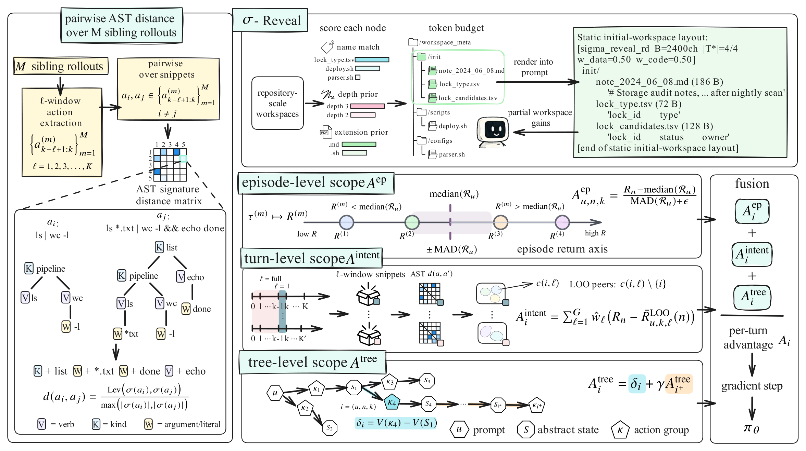

# Learning CLI Agents with Structured Action Credit under Selective Observation

<p align="center">
  <a href="https://arxiv.org/abs/2605.08013"></a>
  <a href="https://github.com/Hoyant-Su/Agentic-RL-A3"></a>
  <a href="https://huggingface.co/datasets/Hoyant-Su/ShellOps"></a>
</p>

**[May 2026]** Code for **Learning CLI Agents with Structured Action Credit under Selective Observation** is released on [GitHub](https://github.com/Hoyant-Su/Agentic-RL-A3). Companion datasets are available through the [ShellOps Hugging Face page](https://huggingface.co/datasets/Hoyant-Su/ShellOps).

## Proposed Method

**A<sup>3</sup> (Action Advantage Assignment)**  
Native CLI-agent attributes for agentic RL.  
Structured CLI code credit for policy optimization.  
Episode, turn, and trajectory-tree advantages from executable shell actions.

<p align="center">
  
</p>

---

## Quick Start

Create the conda environment and install the sandbox-side CLI dependencies:

```bash
conda env create -f environ/environment.yml
conda activate cli_agent
bash main_entry/pre_build/install_apt.sh
```

`install_apt.sh` prepares the apt libraries required by CLI-agent execution in sandbox. The research implementation is docker-free.

---

## Data

Place benchmark data under `main_entry/data/<bench_name>/`. `shellops_pro` is an OOD infer-only dataset. All other benchmark directories should contain `train.parquet`, `test.parquet`, and the correlated task assets folder.

```bash
mkdir -p main_entry/data
tar -xzvf /path/to/data_a3.tar.gz -C main_entry/data
```

`shellops` and `shellops_pro` are the task-specific datasets introduced in this work and are released on [A3_huggingface_page](https://huggingface.co/datasets/Hoyant-Su/ShellOps). The remaining benchmark splits are derived from existing open-source datasets. Due to upstream license constraints, please contact the authors for access to the reconstructed data. Issues and questions are welcome in [A3_issues_link](https://github.com/Hoyant-Su/Agentic-RL-A3/issues).

Supported benchmark keys include `agentbench_os`, `databench`, `shellops`, `ehrcon_curated`, `agentbench_dbbench`, `tablebench`, and `shellops_pro`.

---

## Training

Configure the A3 run in `main_entry/cli_agent_bash_coding/train/A3_algo/config.yaml`. The main fields to set are the benchmark list, base model path, batch sizes, and A3 hyperparameters. For mixed-benchmark training:

```yaml
settings:
  bench: ["agentbench_os", "databench", "shellops", "ehrcon_curated", "agentbench_dbbench", "tablebench"]
```

Launch training with:

```bash
cd main_entry/cli_agent_bash_coding/train/A3_algo
bash launch_bash_coding.sh
```

Checkpoints are written to `main_entry/cli_agent_bash_coding/checkpoints/`, and run metadata/results are written under `main_entry/cli_agent_bash_coding/results/`.

---

## Inference

Inference with a trained model uses the same A3 entrypoint as training. In `main_entry/cli_agent_bash_coding/train/A3_algo/config.yaml`, fill `model.checkpoint_pair` with the trained checkpoint and the base model path:

```yaml
model:
  checkpoint_pair: "<trained_checkpoint>:<pretrained_model_path_default>"
  pretrained_model_path_default: "Qwen/Qwen3-14B"
```

Once `checkpoint_pair` is set, the launcher enters TEST MODE automatically. Use `vanilla` for the standard harness and `sigma_reveal_rd` for $\sigma$-Reveal.

Then run:

```bash
cd main_entry/cli_agent_bash_coding/train/A3_algo
bash launch_bash_coding.sh
```

---

## Evaluation

Inference outputs JSONL trajectories under `main_entry/cli_agent_bash_coding/results/` or the configured output path. Aggregate and score a run with:

```bash
export RESULTS_JSONL="main_entry/cli_agent_bash_coding/results/<run>/<file>.jsonl"
bash main_entry/cli_agent_bash_coding/eval/run_eval_results_jsonl.sh "$RESULTS_JSONL" [optional_parquet_path]
```

Set `EVAL_WORKERS` to control evaluation parallelism.

---

## Citation

```bibtex
@misc{su2026learningcliagentsstructured,
      title={Learning CLI Agents with Structured Action Credit under Selective Observation}, 
      author={Haoyang Su and Ying Wen},
      year={2026},
      eprint={2605.08013},
      archivePrefix={arXiv},
      primaryClass={cs.AI},
      url={https://arxiv.org/abs/2605.08013}, 
}
```
